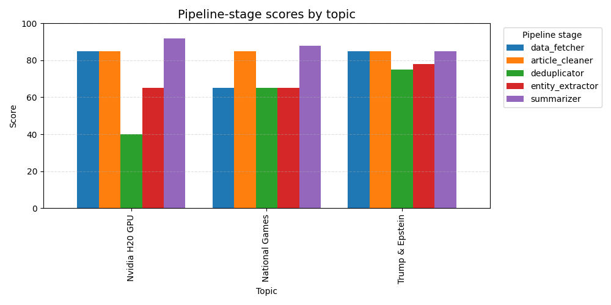

# Experiments

In our experiment config, RSS feeds of medias from Hong Kong SAR and United States, web search tool scraping Google News and China's search Engine Baidu News is selected. So it would cover the two major Country in the world, where important events happend and discussed.

Here we would test and score the performance of major modules in the data processing pipline, by inspecting the output of different topic.

## Performance Evaluation

In this section, we use a self-defined LLM criticizer to evaluate the performance different modules in our pipeline.

## The LLM criticizer

We share the input format, output format and requirement across every evaluation to make sure the stability of the scoring result.

The requirements of each modules are:

- data_fetcher: Fetch relevant news articles based on the given topic from various sources. Consider comprehensiveness first.
- article_cleaner: Clean the raw articles by removing HTML tags, special characters, and irrelevant content.
- deduplicator: Remove duplicate articles based on title and content similarity.
- entity_extractor: Extract key entities such as people, organizations, and locations from the articles.
- summarizer: Generate a concise summary of the topic based on the articles.
- timeline_generator: Create a timeline of events from the articles.

Here is an example output of the LLM criticizer:

```md
topic:  Nvidia H20 GPU

| modulename | score (0-100) | comment |
| --- | --- | --- |
| data_fetcher | 85 | The module demonstrates strong comprehensiveness with 20 diverse articles covering multiple perspectives on the Nvidia H20 GPU topic. Strengths include coverage of regulatory aspects, market impacts, competitive landscape (including Chinese alternatives), and geopolitical context from both US and Chinese sources. However, some articles appear to confuse H20 with H200 models, and there's potential duplication in content. The output successfully captures the complex dynamics surrounding this restricted technology, including export controls, production status, and market implications. |
| article_cleaner | 75 | Module successfully removes HTML tags and special characters from raw articles, preserving meaningful Chinese text content. Handles 'No Content' entries appropriately by filtering them out. However, the cleaning appears overly aggressive - some punctuation (commas, periods) and potentially relevant content may have been removed, affecting readability. The output maintains the core technical information about AI chips and trade policies, but the text flow is somewhat disrupted by missing punctuation. |
| deduplicator | 65 | The module successfully removed some obvious duplicates but missed several similar articles, particularly those discussing H20 GPU production halts and export approvals. Key issues include inconsistent handling of numeric variations (e.g., '82%' vs '82'), incomplete coverage of related topics (e.g., Blackwell GPUs, Jensen Huang's statements), and retention of near-duplicates like the two 'H200芯片若重返中国市场影响几何' titles. The output reflects partial effectiveness in title-based deduplication but lacks robust content similarity analysis. |
| entity_extractor | 65 | The module correctly identified key organizations (Nvidia, Alibaba Cloud) and locations (China, Chinese market) with accurate counts, but missed important entities like 'Trump administration', 'Huawei', 'RAND', and 'US-China relations'. It also failed to extract any people or dates, despite their presence in the input. The summary accurately reflects the extracted entities but is incomplete due to omissions. Improvements are needed in entity recognition comprehensiveness. |
| summarizer | 95 | **Summary:** The module output excellently summarizes the potential U.S. approval of NVIDIA H200 chip exports to China, covering technological advantages (HBM3e memory, performance specs), market context (previous restrictions, Chinese demand for H20 variant), competitive impacts on domestic GPUs, and Alibaba Cloud's efficiency innovations. It is concise, well-structured, and factually accurate, though slightly lengthy and could better highlight key implications. **Detailed Analysis:** Strengths include comprehensive coverage of input articles, logical flow from policy to market effects, and integration of Alibaba's solution. Minor weaknesses are the length (could be tighter) and underemphasis on the '82% reduction' detail from inputs. Overall, it meets the requirement effectively with high clarity and relevance. |
```

## Results

### Generated HTML Page

To test the pipeline comprehensively, we tested our pipeline on 3 vary topics:

- Nvidia H20 GPU: H20 GPU is one of the most advance GPU in the world, and it's tidely related to the China-US trade war.
- National Games: This is a recent important event but limited to China. We intentionally ommit China to see if the summarizer can generate the summary we want.
- Trump & Epstein: Trump and Epstein is a topic be tracked by many media and has very high and consistent attention.

here we only show a Screenshot of a part of the generated html page of topic Trump & Epstein due to the limited space:


all these html files can be found at exampmles/{topics}/{topic}_summary.html

### Performance

We apply the LLM criticizer to all three topics mentioned above:

|                 | data_fetcher | article_cleaner | deduplicator | entity_extractor | summarizer |
|-----------------|--------------|-----------------|--------------|------------------|------------|
| Nvidia H20 GPU  | 85           | 85              | 40           | 65               | 92         |
| National Games  | 65           | 85              | 65           | 65               | 88         |
| Trump & Epstein | 85           | 85              | 75           | 78               | 85         |



We can see here that on topic "Nation Games", data_fetcherreceive a relatively low score compared to 2 other topics, but the summarizer receive a decent score on this topic. This low score of data_fetcher is caused by the intentional missed keyword "China", but the high score on summarizer prove that our summarization module function well and the data_fetcher is comprehensive, thought cannot precisely guess the user's intention.

Among all modules, we can find that the LLM is not that satisfied with deduplicator and entity_extractor. Let's first analyze the deuplicator. Dive into the data and the comments, we see that some articles are incorrectly removed and some apparently duplicated are kept. This might cause some information loss and computational waste.

As to the entity_extractor, the LLM complain about the coverage of it, but the LLM states that the accuracy is good. As to a clear page, we think this high precision with some loss of coverage is a pros rather than a cons.

all these scoring files can be found at examples/{topics}/scoring_results.
